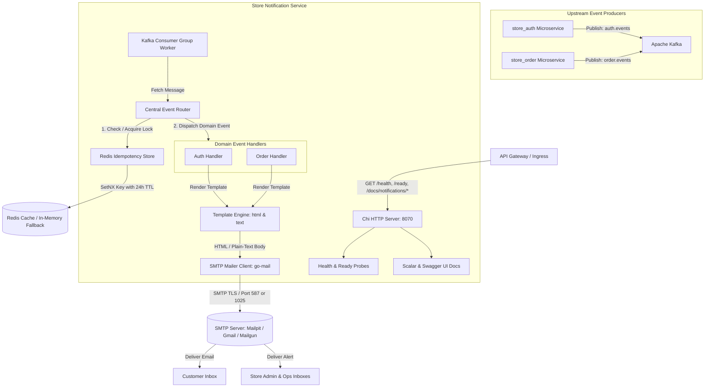
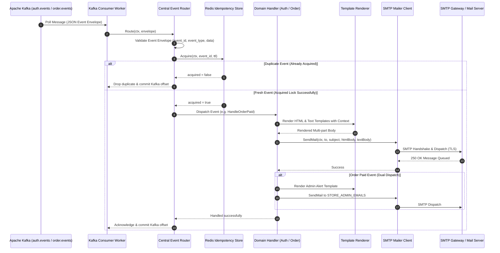

# Store Notification Microservice (`store_notification`)

[](https://go.dev/)
[](https://github.com/go-chi/chi)
[](https://kafka.apache.org/)
[](https://redis.io/)
[](https://github.com/wneessen/go-mail)
[](https://github.com/scalar/scalar)

A production-grade, event-driven Transactional Email and Notification microservice built in Go. It consumes domain events asynchronously from Apache Kafka (`auth.events`, `order.events`), guarantees exactly-once email delivery using Redis-backed distributed idempotency keys, renders multi-part responsive HTML and plain-text email templates, dispatches notifications reliably via SMTP (`go-mail`), and provides embedded interactive OpenAPI 3.1 documentation and health probes.

---

## 📑 Table of Contents

- [Architecture Overview](#-architecture-overview)
- [Key Features](#-key-features)
- [Technology Stack](#-technology-stack)
- [Repository Structure](#-repository-structure)
- [Prerequisites & Environment Configuration](#-prerequisites--environment-configuration)
- [Getting Started (Local Development)](#-getting-started-local-development)
- [API Endpoints & Health Probes](#-api-endpoints--health-probes)
- [Kafka Event Pipeline & Schemas](#-kafka-event-pipeline--schemas)
- [Redis Idempotency & Deduplication](#-redis-idempotency--deduplication)
- [Email Templates & Notification Scenarios](#-email-templates--notification-scenarios)
- [Developer Simulation & CLI Tools](#-developer-simulation--cli-tools)
- [Testing](#-testing)
- [Docker Deployment](#-docker-deployment)

---

## 🏗 Architecture Overview



### Event Processing & Idempotency Lifecycle



---

## 🌟 Key Features

1. **Asynchronous Kafka Event Consumption**: Listens across multiple topic partitions (`auth.events`, `order.events`) using `segmentio/kafka-go` consumer group orchestration with graceful context cancellation.
2. **Distributed Idempotency & Deduplication**: Prevents duplicate email dispatches during Kafka consumer group rebalances or producer retries by acquiring atomic Redis keys (`SETNX` with a 24-hour sliding TTL).
3. **Resilient In-Memory Fallback**: Automatically degrades to an in-memory concurrent cache if Redis is temporarily unreachable during startup, ensuring zero downtime in local testing environments.
4. **Multi-Part Responsive Email Engine**: Pre-compiles and executes Go `html/template` layouts with a clean common wrapper (`base.html`) and responsive CSS styling, accompanied by plain-text fallback content.
5. **Customer & Admin Alert Routing**: Automatically splits order confirmation delivery: dispatches branded customer receipts while concurrently notifying store administrators (`STORE_ADMIN_EMAILS`) for paid orders.
6. **Embedded Interactive API Documentation**: Serves live OpenAPI 3.1 specifications rendered via **Scalar UI** (`/docs/notifications/scalar`) and **Swagger UI** (`/docs/notifications/swagger`) using relative path resolution for seamless API gateway reverse-proxy integration.
7. **Container Health & Readiness Probes**: Detailed `/health` and `/ready` endpoints verifying service liveness, Kafka consumer group connectivity, Redis connection, and SMTP mailer readiness.
8. **Developer Simulation CLI Utilities**: Built-in CLI tools (`cmd/kafka-producer` and `cmd/test-send`) to simulate real-world Kafka event publishing and trigger instant SMTP dispatch testing across all scenarios.

---

## 🛠 Technology Stack

- **Language**: Go 1.26+
- **HTTP Routing**: [Chi v5](https://github.com/go-chi/chi) with CORS & logging middlewares
- **Event Streaming**: [segmentio/kafka-go](https://github.com/segmentio/kafka-go)
- **Caching & Idempotency**: [go-redis/v9](https://github.com/redis/go-redis)
- **SMTP Mail Client**: [wneessen/go-mail](https://github.com/wneessen/go-mail)
- **Template Engine**: Standard Go `html/template` and `text/template` with `embed.FS`
- **API Documentation**: OpenAPI 3.1, [Scalar](https://github.com/scalar/scalar), [Swagger UI](https://swagger.io/tools/swagger-ui/)
- **Containerization**: Multi-stage Alpine Dockerfile

---

## 📁 Repository Structure

```
store_notification/
├── bin/                            # Compiled binaries (generated locally)
├── cmd/
│   ├── kafka-producer/             # CLI simulation tool: Publish test order events to Kafka
│   │   └── main.go
│   ├── server/                     # Application bootstrap & dependency injection
│   │   └── main.go                 # Service entry point (Consumer, HTTP Server, Shutdown)
│   └── test-send/                  # CLI test utility: Direct template & SMTP testing tool
│       └── main.go
├── docs/
│   ├── embed.go                    # Embedded OpenAPI 3.1 specification via embed.FS
│   ├── openapi.json                # OpenAPI 3.1 specification (JSON format)
│   └── openapi.yaml                # OpenAPI 3.1 specification (YAML format)
├── internal/
│   ├── config/                     # Environment variable parsing and validation (.env)
│   ├── consumer/                   # Kafka consumer group worker loop
│   ├── domain/                     # Event envelopes, DTOs, and email context definitions
│   ├── handler/                    # Domain event handlers (Auth, Order) & central router
│   ├── http/                       # Chi HTTP router, health probes, doc endpoints
│   ├── idempotency/                # Redis and in-memory idempotency deduplication stores
│   ├── mailer/                     # SMTP mailer client (go-mail) & mock mailer
│   └── template/                   # Template rendering engine (HTML & Plain Text)
├── openspec/                       # OpenSpec specifications and planning artifacts
├── templates/                      # Go html/template & text/template files
│   ├── admin/                      # Admin alert templates (admin_order_alert.html)
│   ├── auth/                       # Auth OTP templates (registration & password reset)
│   ├── embed.go                    # Embedded filesystem for templates
│   ├── layout/                     # Base HTML email wrapper (base.html)
│   └── order/                      # Customer order lifecycle templates
├── Dockerfile                      # Multi-stage Alpine container build definition
├── Makefile                        # Standard development and build targets
├── go.mod / go.sum                 # Go module definitions
└── .env.example                    # Environment variable configuration template
```

---

## ⚙️ Prerequisites & Environment Configuration

### Prerequisites
- **Go**: Version 1.26 or higher
- **Apache Kafka**: Version 3.x+
- **Redis**: Version 7.x+
- **SMTP Server**: Mailpit, Mailtrap, AWS SES, or Gmail SMTP server

### Configuration Options (`.env`)

Copy the example configuration file:
```bash
cp .env.example .env
```

| Variable | Type | Default | Description |
| :--- | :--- | :--- | :--- |
| `APP_ENV` | `string` | `development` | Runtime environment (`development`, `staging`, `production`) |
| `PORT` | `string` | `8070` | HTTP port for health probes and API documentation |
| `KAFKA_BROKERS` | `string` | `localhost:9092` | Comma-separated list of Kafka broker addresses |
| `KAFKA_GROUP_ID` | `string` | `store-notification-group` | Kafka consumer group identifier |
| `KAFKA_TOPICS` | `string` | `auth.events,order.events` | Comma-separated list of Kafka topics to subscribe to |
| `REDIS_URL` | `string` | `localhost:6379` | Redis host and port for distributed idempotency tracking |
| `REDIS_PASSWORD` | `string` | `""` | Optional password for Redis authentication |
| `REDIS_DB` | `int` | `0` | Redis logical database index |
| `IDEMPOTENCY_TTL_HOURS`| `int` | `24` | TTL in hours for acquired event deduplication keys |
| `SMTP_HOST` | `string` | `localhost` | SMTP server hostname (e.g., `localhost`, `smtp.gmail.com`) |
| `SMTP_PORT` | `int` | `1025` | SMTP server port (`1025` for Mailpit, `587` for TLS) |
| `SMTP_USER` | `string` | `""` | SMTP username / credential |
| `SMTP_PASSWORD` | `string` | `""` | SMTP password or app-specific password |
| `SMTP_FROM_EMAIL` | `string` | `noreply@store.example.com`| Default outbound sender email address |
| `SMTP_FROM_NAME` | `string` | `Store Notifications` | Default outbound sender display name |
| `SMTP_REQUIRE_TLS` | `bool` | `false` | Set `true` to enforce STARTTLS on connection |
| `SMTP_INSECURE_SKIP_VERIFY`| `bool` | `false` | Set `true` to bypass SSL certificate validation (dev only) |
| `STORE_ADMIN_EMAILS` | `string` | `admin@store.example.com` | Comma-separated list of administrator alert emails |

---

## 🚀 Getting Started (Local Development)

1. **Clone the repository**:
   ```bash
   git clone https://github.com/Sall-lah/store_notification.git
   cd store_notification
   ```

2. **Install Go Dependencies**:
   ```bash
   go mod download
   ```

3. **Configure Environment Variables**:
   ```bash
   cp .env.example .env
   # Edit .env to set your Kafka brokers, Redis instance, and SMTP provider
   ```

4. **Start Local Development Dependencies** (Optional via Mailpit & Redis):
   ```bash
   # Example: Run Mailpit for local SMTP capture
   docker run -d -p 1025:1025 -p 8025:8025 --name mailpit axllent/mailpit
   # Web UI: http://localhost:8025 | SMTP Server: localhost:1025
   ```

5. **Run the Service**:
   ```bash
   go run cmd/server/main.go
   ```

   The service starts the Kafka consumer worker and opens the HTTP probe server at `http://localhost:8070`.

---

## 📡 API Endpoints & Health Probes

Interactive API documentation and operational probes are served directly by the embedded HTTP router:

- **Scalar UI**: [http://localhost:8070/docs/notifications/scalar](http://localhost:8070/docs/notifications/scalar) (or `/docs/notifications/`)
- **Swagger UI**: [http://localhost:8070/docs/notifications/swagger](http://localhost:8070/docs/notifications/swagger)
- **OpenAPI 3.1 Specs**: [http://localhost:8070/docs/notifications/openapi.json](http://localhost:8070/docs/notifications/openapi.json) or `/docs/notifications/openapi.yaml`

### Endpoint Catalog

| Group | Method | Path | Auth / Headers | Description |
| :--- | :--- | :--- | :--- | :--- |
| **Health** | `GET` | `/health` | None | Basic container liveness probe (`{"status":"UP"}`) |
| **Health** | `GET` | `/ready` | None | Readiness probe checking Redis, Kafka, and SMTP status |
| **Documentation** | `GET` | `/docs/notifications/scalar` | None | Interactive Scalar API documentation UI |
| **Documentation** | `GET` | `/docs/notifications/swagger`| None | Interactive Swagger API documentation UI |
| **Documentation** | `GET` | `/docs/notifications/openapi.yaml` | None | OpenAPI 3.1 YAML schema definition |
| **Documentation** | `GET` | `/docs/notifications/openapi.json` | None | OpenAPI 3.1 JSON schema definition |

---

## 📦 Kafka Event Pipeline & Schemas

The microservice operates as a consumer on Kafka topics `auth.events` and `order.events`. Every message must arrive wrapped in the standard `EventEnvelope`.

### Standard Event Envelope

```json
{
  "event_id": "evt-550e8400-e29b-41d4-a716-446655440000",
  "event_type": "order.paid",
  "timestamp": "2026-09-01T10:00:00Z",
  "producer": "store_order",
  "data": { ... }
}
```

### Inbound Domain Event Matrix

| Topic | Event Type | Trigger Condition | Payload Summary | Recipient Targets |
| :--- | :--- | :--- | :--- | :--- |
| `auth.events` | `auth.registration_otp` | New customer account registration | Email, verification OTP code, customer name | Customer Email |
| `auth.events` | `auth.password_reset_otp` | Customer password reset request | Email, password reset OTP code, customer name | Customer Email |
| `order.events` | `order.created` | New checkout initiated in `store_order` | Order ID, Order Number, Total Amount, Snap Redirect URL, Line Items | Customer Email |
| `order.events` | `order.paid` | Midtrans payment settlement confirmed | Order Number, Payment Type, Paid Timestamp, Line Items, Total Amount | **Customer Receipt** + **Store Admin Alert** (`STORE_ADMIN_EMAILS`) |
| `order.events` | `order.cancelled` | Order cancelled by customer, admin, or user ban | Order Number, Cancellation Reason, Line Items | Customer Email |
| `order.events` | `order.expired` | Payment window expired without settlement | Order Number, Expiration Reason, Line Items | Customer Email |
| `order.events` | `order.fulfilled` | Order shipped or completed delivery | Order Number, Courier info, Tracking Number, Items | Customer Email |

---

## 🛡 Redis Idempotency & Deduplication

In distributed event streaming architectures, network retries and Kafka rebalances can cause consumers to receive duplicate messages.

### Idempotency Strategy
1. Upon receiving an event, the `Router` inspects `envelope.event_id`.
2. It executes an atomic Redis lock:
   ```text
   SET idempotency:event:<event_id> 1 NX EX 86400
   ```
3. **If key already exists (`acquired = false`)**: The router drops the event immediately, logs an informational message, and commits the Kafka offset without resending emails.
4. **If key is new (`acquired = true`)**: The handler renders templates and dispatches the email.
5. **Fallback Store**: If Redis is unreachable on boot, `NewMemoryStore()` provides thread-safe local sync map caching for development.

---

## ✉️ Email Templates & Notification Scenarios

Templates are located in `templates/` and pre-compiled using Go's `embed.FS`:

```
templates/
├── layout/base.html            # Universal HTML wrapper (Branding, styling, typography, footer)
├── auth/
│   ├── registration_otp.html   # Registration OTP layout
│   ├── registration_otp.txt    # Plain-text registration fallback
│   ├── password_reset_otp.html # Password reset OTP layout
│   └── password_reset_otp.txt  # Plain-text password reset fallback
├── order/
│   ├── order_created.html      # Checkout confirmation with payment link
│   ├── order_paid.html         # Payment receipt with itemized invoice table
│   ├── order_cancelled.html    # Cancellation notice with restock reason
│   ├── order_expired.html      # Payment window expiry notification
│   └── order_fulfilled.html    # Shipping & tracking notification
└── admin/
    └── admin_order_alert.html  # Store administrator order alert notification
```

---

## 🧪 Developer Simulation & CLI Tools

Two specialized CLI tools are included in `cmd/` for fast local testing and verification without requiring live external services.

### 1. Direct Email Simulation Tool (`cmd/test-send`)
Directly executes template rendering and SMTP dispatch to a target email address across various domain scenarios:

```bash
# Test all scenarios (Auth OTP, Order Created, Paid, Cancelled, Expired, Fulfilled, Admin Alert)
go run cmd/test-send/main.go -email your-email@example.com -scenario all

# Test specific scenarios
go run cmd/test-send/main.go -email your-email@example.com -scenario paid
go run cmd/test-send/main.go -email your-email@example.com -scenario created
go run cmd/test-send/main.go -email your-email@example.com -scenario cancelled
go run cmd/test-send/main.go -email your-email@example.com -scenario expired
```

### 2. Kafka Event Stream Simulation Tool (`cmd/kafka-producer`)
Publishes realistic synthetic `order.events` JSON envelopes directly to your local Kafka broker to verify consumer group ingestion and Redis idempotency:

```bash
go run cmd/kafka-producer/main.go -email your-email@example.com
```

---

## 🧪 Testing

Run comprehensive unit and race detection test suites:

```bash
# Run all test packages
go test -v ./...

# Run test suite with race detector and coverage
go test -race -cover ./...
```

---

## 🐳 Docker Deployment

A production-ready, multi-stage Alpine Dockerfile is included:

1. **Build Container Image**:
   ```bash
   docker build -t store_notification:latest .
   ```

2. **Run Container**:
   ```bash
   docker run -d \
     --name store_notification \
     -p 8070:8070 \
     -e APP_ENV="production" \
     -e KAFKA_BROKERS="kafka:9092" \
     -e KAFKA_TOPICS="auth.events,order.events" \
     -e REDIS_URL="redis:6379" \
     -e SMTP_HOST="smtp.mailgun.org" \
     -e SMTP_PORT="587" \
     -e SMTP_USER="postmaster@yourdomain.com" \
     -e SMTP_PASSWORD="your-smtp-password" \
     -e SMTP_FROM_EMAIL="noreply@yourdomain.com" \
     -e STORE_ADMIN_EMAILS="admin@yourdomain.com" \
     store_notification:latest
   ```

3. **Check Service Health**:
   ```bash
   curl http://localhost:8070/health
   curl http://localhost:8070/ready
   ```
